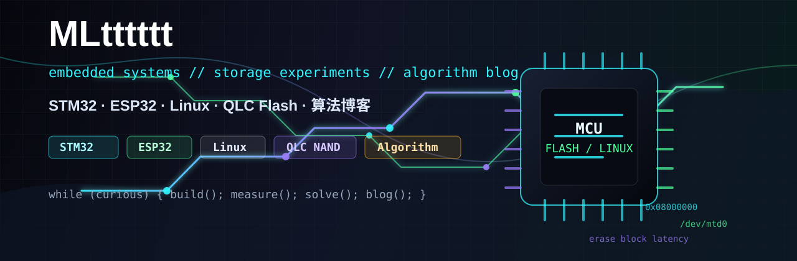

<p align="center">
  
</p>

<h1 align="center">Hi, I'm MLtttttt</h1>

<p align="center">
  <b>Embedded learner · Linux tinkerer · Flash storage experimenter · Algorithm blogger</b>
</p>

<p align="center">
  
  
  
  
  
  
  
</p>

---

## Current Focus

```txt
MCU       -> STM32 / ESP32 drivers, peripherals, RTOS basics
Linux     -> embedded Linux, cross compilation, device and filesystem notes
Storage   -> NAND flash, QLC behavior, latency and reliability experiments
Code      -> C/C++, Python scripts, algorithms, debugging records
Blog      -> algorithm articles, templates, mistakes, proofs and review notes
Writing   -> turn every pit into a reusable note
```

## Tech Radar

| Layer | What I'm playing with |
| --- | --- |
| Microcontrollers | STM32F103, ESP32, GPIO, UART, I2C, SPI, OLED/LCD, sensors |
| Firmware | HAL, FreeRTOS, startup files, linker scripts, build logs |
| Linux | Ubuntu, embedded Linux workflow, cross toolchains, shell scripts |
| Storage | NAND flash concepts, QLC characteristics, erase/write/read latency |
| Algorithm Blog | Data structures, problem patterns, proofs, mistakes and review posts |
| CS Basics | C language details, debugging habits, complexity analysis |

## Lab Style

```c
while (curious) {
    read_datasheet();
    wire_board();
    write_driver();
    run_test();
    measure_result();
    document_bug();
}
```

## Repository Map

- `算法笔记`：刷题、数据结构、复杂度和易错点记录
- `算法博客`：把题解、套路、证明、错题和复盘整理成可持续更新的文章
- `STM32 / ESP32`：外设驱动、实验工程、踩坑复盘
- `Linux`：环境搭建、交叉编译、命令和系统实验
- `Flash / QLC`：闪存机制、性能测试、论文/实验记录

## GitHub Stats

<p align="center">
  
  
</p>

<p align="center">
  
</p>

---

<p align="center">
  <b>Learning by building, breaking, measuring, and writing it down.</b>
</p>
